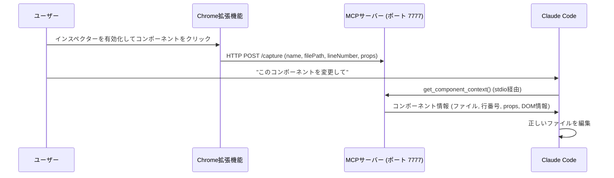

# react-inspector-mcp

Chrome拡張機能とMCPサーバーを組み合わせたブリッジツールです。ブラウザ上でReactコンポーネントをクリックするだけで、そのソースコードの場所をClaude Codeに即座に共有できます。

「サーバーコントロールパネルの緑のボタン、だいたい45行目あたり」と説明する代わりに、直接クリックするだけです。


[English](./README.md)

## デモ

https://github.com/user-attachments/assets/3c0a56e3-e17c-4703-b64d-d357d228f617


## 必要環境

- Node.js 18+
- Google Chrome
- 開発モードで起動しているReactアプリ（例：Viteの `npm run dev`）

## セットアップ

### 1. MCPサーバーの依存関係をインストール

```bash
cd mcp-server
npm install
```

### 2. Claude Codeに登録

```bash
claude mcp add react-inspector-mcp -- node /absolute/path/to/mcp-server/server.mjs
```

`/absolute/path/to` の部分は、このリポジトリをクローンした実際のパスに置き換えてください。

### 3. Chrome拡張機能を読み込む

1. `chrome://extensions/` を開く
2. 右上の **デベロッパーモード** を有効にする
3. **パッケージ化されていない拡張機能を読み込む** をクリック
4. このリポジトリの `extension/` ディレクトリを選択

## 使い方

1. Reactの開発サーバーを起動する（`npm run dev`）
2. Chromeの **React Inspector MCP** アイコンをクリック → **Enable Inspector**
3. UIにホバーすると、ボックスモデルのオーバーレイで要素がハイライトされます：
   - 🟠 オレンジ — マージン
   - 🟡 イエロー — ボーダー
   - 🟢 グリーン — パディング
   - 🔵 ブルー — コンテンツ
4. 変更したいコンポーネントをクリック
5. Claude Codeで変更内容を伝える — Claudeが自動で `get_component_context` を呼び出します

## 仕組み



1. 拡張機能のポップアップからインスペクターを有効化
2. 要素にホバー — マージン / パディング / コンテンツ領域を示すボックスモデルオーバーレイが表示されます
3. クリックしてキャプチャ — コンポーネントの名前、ファイルパス、行番号がMCPサーバーに送信されます
4. Claude Codeに変更を依頼 — `get_component_context` を呼び出して編集すべきファイルを正確に把握します

ファイルパスはReactの `_debugSource` から取得されます。これはViteまたはCreate React Appの開発サーバーで起動している場合に利用可能です。


### MCPツール

| ツール | 説明 |
|--------|------|
| `get_component_context` | 最後にキャプチャしたコンポーネントの情報を返します（名前、ファイルパス、行番号、props、DOM情報） |
| `wait_for_component_selection` | ユーザーがコンポーネントをクリックするまで待機し、コンテキストを返します（タイムアウト設定可能） |

## 注意事項

- **開発モード限定**: `filePath` と `lineNumber` はReactの `_debugSource` に依存しており、開発ビルドでのみ利用可能です。コンポーネント名はプロダクションでもキャプチャされます。
- **ポート7777**: HTTPサーバーは `127.0.0.1` にのみバインドされ、外部からはアクセスできません。
