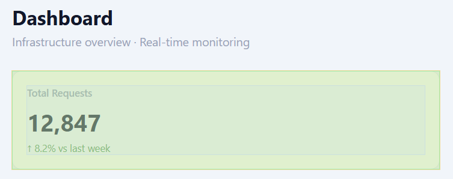
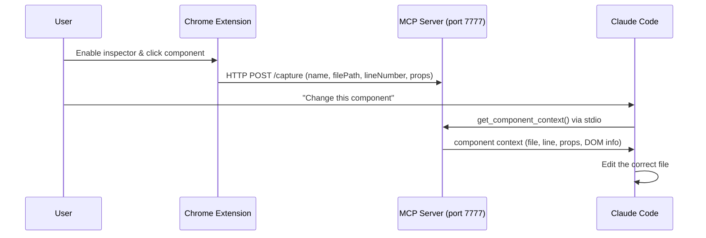

# react-inspector-mcp

A Chrome Extension + MCP Server bridge that lets you click any React component in the browser and instantly share its source location with Claude Code.

Instead of typing "the green button in the server controls panel around line 45", just click it.




## Demo

https://github.com/user-attachments/assets/3c0a56e3-e17c-4703-b64d-d357d228f617


## Requirements

- Node.js 18+
- Google Chrome
- A React app running in development mode (e.g. `npm run dev` with Vite)

## Setup

### 1. Install MCP Server dependencies

```bash
cd mcp-server
npm install
```

### 2. Register with Claude Code

```bash
claude mcp add react-inspector-mcp -- node /absolute/path/to/mcp-server/server.mjs
```

Replace `/absolute/path/to` with the actual path where you cloned this repo.

### 3. Load the Chrome Extension

1. Open `chrome://extensions/`
2. Enable **Developer mode** (top right toggle)
3. Click **Load unpacked**
4. Select the `extension/` directory in this repo

## Usage

1. Start your React dev server (`npm run dev`)
2. Click the **React Inspector MCP** icon in Chrome → **Enable Inspector**
3. Hover over the UI — elements are highlighted with a color-coded box-model overlay:
   - 🟠 Orange — margin
   - 🟡 Yellow — border
   - 🟢 Green — padding
   - 🔵 Blue — content
4. Click the component you want to change
5. In Claude Code, describe what you want — Claude will call `get_component_context` automatically

## How it works



1. Enable the inspector from the extension popup
2. Hover over any element — a box-model overlay shows margin / padding / content areas
3. Click to capture — the component's name, file path, and line number are sent to the MCP server
4. Ask Claude Code to make a change — it calls `get_component_context` to know exactly which file to edit

The file path comes from React's `_debugSource`, which is available when running a Vite or Create React App dev server.


### MCP Tools

| Tool | Description |
|------|-------------|
| `get_component_context` | Returns the last captured component (name, file path, line number, props, DOM info) |
| `wait_for_component_selection` | Blocks until the user clicks a component, then returns its context (with configurable timeout) |

## Notes

- **Dev mode only**: `filePath` and `lineNumber` rely on React's `_debugSource`, which is only present in development builds. The component name is still captured in production.
- **Port 7777**: The HTTP server binds to `127.0.0.1` only and is not accessible externally.
